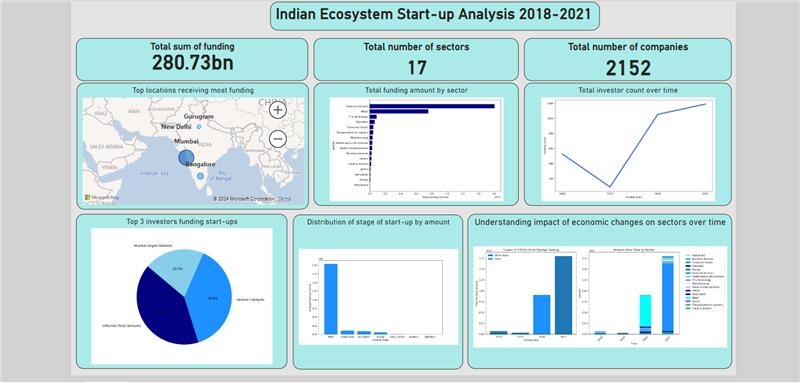

<a name="readme-top"></a>

<div align="center">
  <h1><b>Exploring the Indian Startup Ecosystem</b></h1>
</div>

<!-- TABLE OF CONTENTS -->

# 📗 Table of Contents

- [📗 Table of Contents](#-table-of-contents)
- [Project Description ](#attrition-insight-)
  - [🛠 Built with ](#-built-with-)
    - [Tech Stack ](#tech-stack-)
  - [Key Insights ](#key-features-)
  - [💻 Getting Started ](#-getting-started-)
    - [Prerequisites](#prerequisites)
    - [Setup](#setup)
  - [👥 Authors ](#-authors-)
  - [🤝 Contributing ](#-contributing-)
  - [⭐️ Show your support ](#️-show-your-support-)
  - [🙏 Acknowledgments ](#-acknowledgments-)
  - [📝 License ](#-license-)

<!-- PROJECT DESCRIPTION -->

# Indian Startup Analysis <a name="about-project"></a>

**Exploring the Indian Startup Ecosystem:  A Data Driven Analysis of Funding Trends and Industry Sectors** The Indian startup ecosystem is one of the largest and fastest-growing in the world, with a consistent annual growth rate of 12-15%. As of 2018, India was home to more than 50,000 startups, with 2-3 tech startups being born every day. This vibrant ecosystem is becoming increasingly attractive for investors, startups, and corporates alike.
   As team of data analysts, we are to investigate the ecosystem and propose the best course of action for our stakeholders using the data regarding funding received by startups in India from 2018-2019.
   Therefore, the aim of this project is to perform analysis on the Indian start-ups ecosystem and advice stakeholders to invest on a venture that has the potential of high profit/income.

1. **Company/Brand**: Name of company/start-up
2. **Founded**: Year Start-up was founded
3. **Sector**: Sector of service
4. **What it Does**: Description of the company
5. **Investor**: Investors
6. **Amount**: Raised Funds
7. **Stage**: Round of funding reached
8. **Headquarter**: Location of company

## 🛠 Built With <a name="Technologies Used"></a>
The analysis of the Indian Startup Ecosystem using the 2018-2021 funding datasets was done following the CRISP-DM process. It also involved a variety of technologies, programming languages, and libraries to process, analyze, and visualize the data. The following tools were utilized:
4. _Python_: Python programming language was the backbone of the project, used for data processing, analysis, and visualization tasks.
5. _Pandas_ and NumPy: Pandas and NumPy libraries were essential for data manipulation and numerical computations.
6. _Matplotlib and Seaborn_: Matplotlib and Seaborn were employed for data visualization, creating insightful charts and graphs to represent the findings.
7. _Visual Studio Code and Jupyter Notebooks_: Jupyter Notebooks within the Visual Studio IDE provided an interactive environment for running code, visualizing data, and documenting the analysis process.
8. _Scikit-learn_: Scikit-learn's library SimpleImputer was utilized for imputing null values in the amount column.
9. _SQL_: Structured Query Language (SQL) was used for database querying and data retrieval when needed.
10. _GitHub_: GitHub served as the version control system for the project, enabling collaboration and tracking changes in the codebase.
    These technologies played a crucial role in the successful implementation of the project, providing the necessary tools to analyze and derive insights from the Indian Startup Ecosystem funding datasets.

<details>
  <summary>Data Sources</summary>
  <p>The data for this project was sourced from different places. The 2018 and 2019 datasets were collected from GitHub via provided links, and the 2020 and 2021 datasets from a remotely secured database using credentials provided by client.</p>
</details>

<details>
<summary>Database</summary>
  <ul>
    <li><a href="">Microsoft SQL Server</a></li>
  </ul>
</details>

<details>
<summary>Language</summary>
  <ul>
    <li><a href="">Python</a></li>
  </ul>
</details>


<p align="right">(<a href="#readme-top">back to top</a>)</p>
<!-- Features -->

## Success Criteria <a name="key-features"></a>
- To find the correlation and the p-value between the funding amount and the various features of the startups, such as industry sector, location, age, stage, etc. This will help give the stakeholders (team) about the strength and significance of the relationship between the funding amount and the potential factors

- To build an interactive dashboard with Power BI to visualize the fundings received by Indian start-ups based on the seleced features of the start-ups. The findings from the analysis will be used by the stakeholders (team) to make informed decisions about which factors to consider before venturing into a start-up.

- To perform hypothesis test to either reject or accept the Null hypothesis 

## Key Insights <a name="key-Insights"></a>
The analysis of the Indian Startup Ecosystem using the 2018-2021 funding datasets has yielded valuable insights into the funding trends and dynamics within the ecosystem. Based on the EDA and visualizations conducted, the following key findings and conclusions have been drawn:
1. _Sector Disparities_:
   - Certain sectors, such as financial services,retail, IT & Technology, received a significantly higher amount of funding compared to others like agriculture or manufacturing.
   - Startups in high-growth sectors tended to attract more funding, indicating investor interest in innovative and scalable ventures.
1. _Regional Disparities_:
   - Specific locations, such as metropolitan areas or tech hubs, attracted a disproportionate amount of funding compared to rural or less developed regions.
   - The concentration of funding in certain regions highlighted the importance of geographic location in accessing capital and resources.
1. _Startup Stage Influence_:
   - Analysis revealed that startups in later stages, such as Series C or beyond, tended to secure larger funding amounts compared to early-stage ventures.
   - The maturity and proven track record of older startups played a significant role in attracting investor confidence and larger investments.
1. _Investor Preferences_:
   - Investors showed a preference for sectors with high growth potential and proven market demand, aligning their funding decisions with industry trends and market dynamics.
   - Understanding investor preferences and sector trends can help startups tailor their pitches and strategies to attract funding effectively.
1. _Strategic Implications_:
   - The findings suggest that startups in underfunded sectors or regions may need to focus on differentiation, innovation, and networking to attract investment.
   - Startups at earlier stages should emphasize building credibility, market validation, and scalability to increase their attractiveness to potential investors.


<p align="right">(<a href="#readme-top">back to top</a>)</p>


<!-- GETTING STARTED -->

## 💻 Getting Started <a name="getting-started"></a>


To get a local copy up and running, follow these steps.

### Prerequisites

In order to run this project you need:

- Python


### Setup

Clone this repository to your desired folder:


```sh
  cd my-folder
  git clone https://github.com/adubrightkwartengsnr/Indian_Startup_Ecosystem_Analysis_2018-2021
```

Change into the cloned repository

```sh
  cd Indian_Startup_Ecosystem_Analysis_2018-2021
  
```

Create a virtual environment

```sh

python -m venv env

```

Activate the virtual environment

```sh
    env/Scripts/activate
```


### Install

Here, you need to recursively install the packages in the `requirements.txt` file using the command below 

```sh
   pip install -r requirements.txt
```


<!-- AUTHORS -->

## 👥 Authors <a name="authors"></a>

🕵🏽‍♀️ **Bright Adu Kwarteng Snr**

- GitHub: [GitHub Profile](https://github.com/adubrightkwartengsnr)
- LinkedIn: [LinkedIn Profile](www.linkedin.com/in/bright-adu-kwarteng-snr)

<p align="right">(<a href="#readme-top">back to top</a>)</p>

<!-- FUTURE FEATURES -->

## 🔭 Future Features <a name="future-features"></a>

While the analysis of the Indian Startup Ecosystem using the 2018-2021 funding datasets has provided valuable insights through data cleaning, EDA, visualizations, univariate analysis and dashboarding, there are several areas for potential future work and improvements to enhance the depth and scope of the analysis:
1. _Machine Learning Integration_:
   - Incorporating machine learning models could offer predictive capabilities, such as forecasting funding trends, identifying startup success factors, or building recommendation systems for investors.
   - Machine learning algorithms could be applied to classify startups into different categories based on funding potential or success likelihood.
1. _Advanced Data Analysis Techniques_:
   - Exploring advanced statistical analysis methods, such as regression analysis, cluster analysis, or time series forecasting, could provide deeper insights into the factors influencing funding outcomes.
   - Leveraging advanced data mining techniques to uncover hidden patterns, anomalies, or correlations within the datasets could reveal additional actionable insights.
1. _Real-Time Data Integration_:
   - Integrating real-time data sources and APIs could enable continuous monitoring of funding activities, market trends, and startup performance, allowing for dynamic and up-to-date analysis.
   - Implementing automated data pipelines for data ingestion, cleaning, and analysis could streamline the process and ensure the analysis is always based on the latest information.
1. _Interactive Dashboards_:
   - Developing interactive dashboards and data visualization tools could enhance the accessibility and usability of the analysis results, enabling stakeholders to explore the data and insights in a user-friendly manner.
   - Incorporating drill-down capabilities, filters, and interactive elements in the visualizations could empower users to conduct ad-hoc analysis and derive customized insights.
1. _Collaborative Research Opportunities_:
   - Collaborating with domain experts, industry professionals, or academic researchers could provide additional perspectives, domain knowledge, and validation of the analysis findings.
   - Engaging in cross-disciplinary research projects or partnerships could lead to innovative insights and solutions for addressing challenges within the startup ecosystem.

By considering these potential future work areas and improvements, the analysis of the Indian Startup Ecosystem can be further enhanced, leading to more comprehensive, actionable, and impactful insights based on the 2018-2021 funding datasets.

  
  
<p align="right">(<a href="#readme-top">back to top</a>)</p>

<!-- CONTRIBUTING -->

## 🤝 Contributing <a name="contributing"></a>

Contributions, issues, and feature requests are welcome!

Feel free to check the [issues page](../../issues/).

<p align="right">(<a href="#readme-top">back to top</a>)</p>

<!-- SUPPORT -->

## ⭐️ Show your support <a name="support"></a>

If you like this project kindly show some love, give it a 🌟 **STAR** 🌟

<p align="right">(<a href="#readme-top">back to top</a>)</p>

<!-- ACKNOWLEDGEMENTS -->

## 🙏 Acknowledgments <a name="acknowledgements"></a>

I would like to express my sincere gratitude to my instructors Racheal Appiah-Kubi and Violette Naa Adoley Allotey for their exceptional guidance, unwavering support, and invaluable mentorship throughout the course of this project. Their expertise, dedication, and commitment to our learning journey have been instrumental in shaping our understanding and skills in data analysis.

I would also like to extend a special thank you to Solomon Nyamson for his valuable advice and insights shared during the development of this project. His experiences and expertise in similar projects have been a source of inspiration and guidance, enriching our project with practical knowledge.


<p align="right">(<a href="#readme-top">back to top</a>)</p>

<!-- LICENSE -->

## 📝 License <a name="license"></a>

This project is [MIT](./LICENSE) licensed.

<p align="right">(<a href="#readme-top">back to top</a>)</p>

<p> align="right">(<a href="https://medium.com/@adubrightkwarrteng11/exploring-the-indian-startup-ecosystem-a-data-driven-analysis-of-funding-trends-and-industry-c200428666c1">Link to Article</a>)</p>


